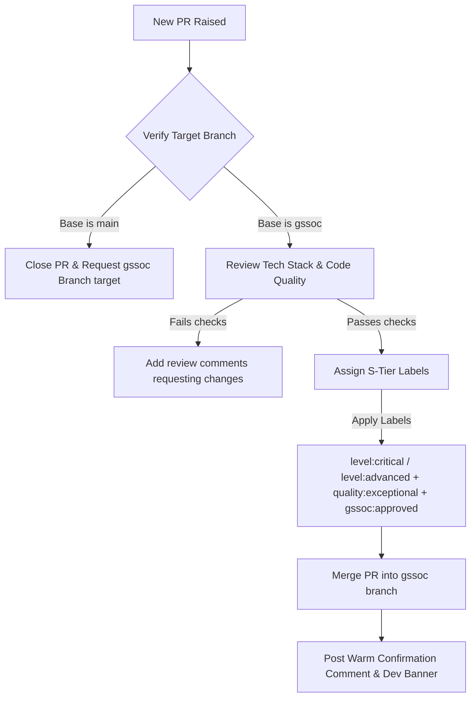

# GSSoC 2026 Mentorship Guide & Review Standard

Welcome to the **HELPDESK.AI Neural Service Orchestrator** GSSoC 2026 Mentoring Team! This guide outlines our review standards, point optimization matrices, and triage procedures designed to support contributors and maximize our collective points to secure **Global Rank #1**!

---

## 🌟 Mentorship Philosophy: Customer-First & S-Tier Standards

Our project relies on a "Customer-First" approach:
1. **Immediate Engagement**: Reply to every issue and PR within 12–24 hours.
2. **Chronological Assignment**: Assign issues to the very first contributor who comments with a clear plan. Encourage others to follow along or tackle parallel open bounties.
3. **Warm, Constructive Tone**: Address contributors by their GitHub handle, praise their work, and offer guidance to elevate their code quality.
4. **Star, Fork & Follow Campaign**: Ensure every single comment you write appends the **Project Support & Developer Network Banner** to build Ritesh's organic profile reach!

---

## 🎯 PR Review & Scoring Matrix

When reviewing Pull Requests, carefully audit the implementation against our tech stack (Vite, React, Tailwind, FastAPI, Python, Supabase). Award labels strategically to maximize GSSoC points for both the **Contributor** and the **Mentor**.

### 1. Contributor Points Formula
$$\text{PR Score} = 50 + (\text{Difficulty Pts} \times \text{Quality Multiplier}) + \text{Type Bonus}$$

| Difficulty Label | Points | Quality Multiplier | Value | Type Bonus Label | Points |
| :--- | :--- | :--- | :--- | :--- | :--- |
| `level:beginner` | 20 pts | `quality:clean` | ×1.2 | `type:docs` | +5 pts |
| `level:intermediate` | 35 pts | `quality:exceptional` | ×1.5 | `type:testing` / `type:design` / `type:refactor` / `type:bug` / `type:feature` | +10 pts |
| `level:advanced` | 55 pts | | | `type:accessibility` / `type:performance` / `type:devops` | +15 pts |
| `level:critical` | 80 pts | | | `type:security` | +20 pts |

> [!TIP]
> **Maximize Contributor Scores**: If a contributor does outstanding work (clean architecture, thorough testing, or bundle optimization), reward them with `quality:exceptional` and `level:critical` / `level:advanced` labels. This helps them climb the contributor charts and keeps them active on our repo!

### 2. Mentor Points Grid (Points credited to the reviewing Mentor)
Mentors earn points for every contributor PR merged under their direct guidance.

| Difficulty Classification | Mentor Base Points | Quality Bonus | Total Points |
| :--- | :--- | :--- | :--- |
| **No difficulty label (Fallback)** | 30 pts | N/A | **30 pts** |
| `level:beginner` | 10 pts | `quality:clean` (+5) / `quality:exceptional` (+10) | **Up to 20 pts** |
| `level:intermediate` | 20 pts | `quality:clean` (+5) / `quality:exceptional` (+10) | **Up to 30 pts** |
| `level:advanced` | 30 pts | `quality:clean` (+5) / `quality:exceptional` (+10) | **Up to 40 pts** |
| `level:critical` | 50 pts | `quality:clean` (+5) / `quality:exceptional` (+10) | **Up to 60 pts** |

---

## 🛠️ Triaging & Labeling Workflows

To ensure our repository stays clean and GSSoC crawler-compatible, follow this lifecycle for every issue and PR:



### Mandatory Labeling Standard
When merging a PR, ensure exactly **one** label from each group is applied:
1. **Approval Label**: `gssoc`, `gssoc:approved`
2. **Difficulty Label**: `level:beginner`, `level:intermediate`, `level:advanced`, or `level:critical` (Prefer S-Tier for exceptional work)
3. **Quality Label**: `quality:clean` or `quality:exceptional`
4. **Type Label**: `type:bug`, `type:feature`, `type:security`, `type:performance`, `type:docs`, etc.

---

## 📢 Standardized Engagement Banner
Every comment posted by a Mentor on an issue or PR **MUST** append this markdown banner:

```markdown
---

### 🌟 Project Support & Developer Network (Show Some Love!)
If you want to support this project and stay connected with me for future opportunities, please take 30 seconds to:
1. ⭐ **Star this repository**: Helps our AI helpdesk get noticed! [Star here](https://github.com/ritesh-1918/HELPDESK.AI)
2. 🍴 **Fork this repository**: Keep a copy to build your own cool tools! [Fork here](https://github.com/ritesh-1918/HELPDESK.AI/fork)
3. 👤 **Follow @ritesh-1918 on GitHub**: Stay updated on real-time open-source projects! [Follow here](https://github.com/ritesh-1918)
4. 💼 **Connect on LinkedIn**: Let's build a strong engineering network! [Connect on LinkedIn](https://www.linkedin.com/in/ritesh1908/)
```

Thank you for your incredible work in leading the **HELPDESK.AI** community! Let's continue building premium, state-of-the-art tech and dominate the GSSoC 2026 Leaderboard! 🚀🔥
